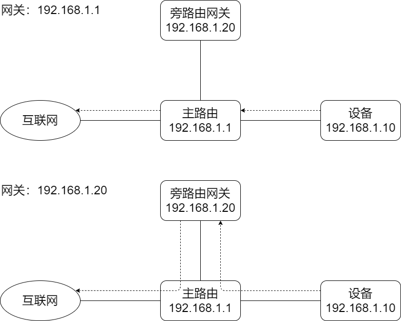

# Network Selector

个人的一个 C# + WinUI3 的练手项目，可以在多个网络配置预设中快速切换。

因为微软没有在 Windows 中提供保存网络设置为预设的功能，对于需要经常切换网关服务器/代理服务器的用户来说十分的麻烦，于是我就开发了这个小工具。

## 项目预览


## ⬇下载

您可以直接到 [Releases · Direct5dom/NetworkSelector](https://github.com/Direct5dom/NetworkSelector/releases) 下载我已经打包好的安装包。

安装需要注意的是，要右键“使用 PowrShell 运行” `Install.ps1`，而不是直接双击`WSAFileLink.msix`。

## ✋使用

### IP 设置

“IP 设置”可以在**“自动”**或其他五个**“预设”**中做选择。

- **自动** - IP 地址和 DNS 都会被更改为 DHCP 模式，遵循上级路由 DHCP 服务器的分配结果。

- **预设** - IP 地址和 DNS 都会被更改为 静态 模式，需要您手动输入网络配置。

### 网卡名称

可以在 **Windows设置 -> 网络和 Internet -> 高级网络设置** 中查看，简体中文名称一般为**“以太网”**。

### IP 地址

您想要设置的本机内网 IPv4 地址。

> 在子网掩码为 `255.255.255.0` 的一般情况下，本机 IPv4 地址的前三段应与上级路由相同。最后一段不应与上级路由器本身地址冲突，最好也不要和上级路由器其他设备冲突。建议提前在路由器中做IP地址预留或绑定IP与MAC。

### 子网掩码

一般为 `255.255.255.0`，用于指明一个 IP 地址的哪些位标识的是主机所在的子网，以及哪些位标识的是主机的位掩码。

### 网关

以一种简单的情况为例：



网关是否指向旁路，意味着流量是否会经过旁路。

> 这也是本项目的目的。一般情况下我们只需要更改网关就能去到不同的网络，但因为 Windows 设置无法记住你的网络配置，因此如果你在设置中改回了“自动”，那么下次就需要全部重新填写。

### 首选 DNS

首选 DNS 服务器，可以直接填写与网关相同的 IP，这样 DNS 的选择就被网关接管了。

### 备选 DNS

备选 DNS 服务器

## 🛠️获取源码

要构建此项目，您需要将项目源码克隆到本地。

您可以使用 Git 命令行：

```
git clone git@github.com:Direct5dom/NetworkSelector.git
```

或者更方便的，使用 Visual Studio 的“克隆存储库”克隆本仓库。

使用 Visual Studio 打开项目根目录的`NetworkSelector.sln`，即可进行调试和打包。

## ⚖️License

[MIT License](https://github.com/Direct5dom/NetworkSelector/blob/master/LICENSE)