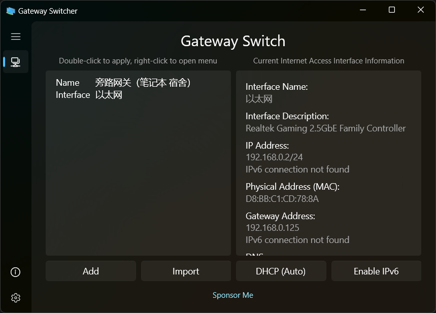
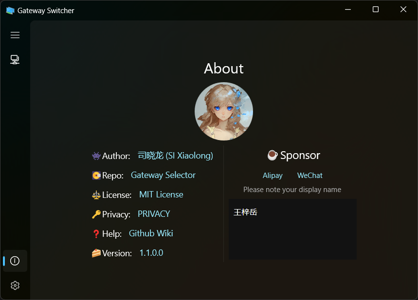

<p align="center">
  <h1 align="center">Gateway Switcher</h1>
  <p align="center">A Gateway Switcher based on WinUI3.</p>
  <p align="center">Quickly switch between many network configuration presets.</p>
  <p align="center">
    <a href="https://github.com/Direct5dom/NetworkSelector/blob/master/LICENSE">
      
    </a>
    <a href="https://github.com/Direct5dom/NetworkSelector/releases">
      
    </a>
  </p>
  <p align="center">
    <a href="https://twitter.com/SI_Xiaolong">
      
    </a>
  </p>
</p>
<p align="center">
  
  
</p>

Because Microsoft does not provide the function of saving network settings as default in Windows, it is very troublesome for users who need to frequently switch gateway servers or proxy servers, so I developed this small tool.

Other languages: **English**, [简体中文](./README.zh-CN.md)

## ⬇Download

### Get it from the Microsoft Store (recommended)

<a href="ms-windows-store://pdp/?ProductId=9PDQC93R0WLF&mode=mini">
   
</a>

### Get a self-signed version from Releases (not recommended)

You can go directly to [Releases · Direct5dom/NetworkSelector](https://github.com/Direct5dom/NetworkSelector/releases) to download the installation package I have packaged.

> It should be noted that because this project uses self-signed sideloading, you need to turn on the developer mode of Windows, right-click and "Use PowrShell" to run Install.ps1 instead of double-clicking WinWoL.msix directly.

> The self-signed version requires turning on developer mode and installing a certificate, which is not a secure way to install an app.

## 🌍Help Translation

See: [Language](./NetworkSelector/Language/)

## 🛠️Source Code

To build this project, you need to clone the project source code locally.

You can use the Git command:

```
git clone git@github.com:Direct5dom/NetworkSelector.git
```

Or more conveniently, use Visual Studio's "Clone Repository" to clone this repository.

Use Visual Studio to open `NetworkSelector.sln` in the project root directory to debug and package.