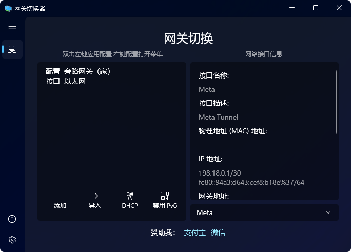
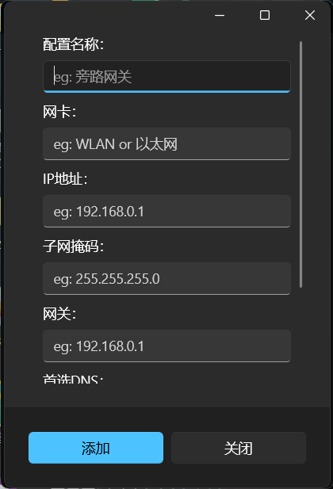

<p align="center">
  <h1 align="center">网关切换器 (Gateway Switcher)</h1>
  <p align="center">一个基于 WinUI3 的网关选择器 (Gateway Switcher)。</p>
  <p align="center">可以实现在多个网络配置预设中快速切换。</p>
  <p align="center">
    <a href="https://github.com/Direct5dom/NetworkSelector/blob/master/LICENSE">
      
    </a>
    <a href="https://github.com/Direct5dom/NetworkSelector/releases">
      
    </a>
  </p>
  <p align="center">
    <a href="https://twitter.com/SI_Xiaolong">
      
    </a>
  </p>
</p>
<p align="center">
  
  
</p>

因为微软没有在 Windows 中提供保存网络设置为预设的功能，对于需要经常切换网关服务器或代理服务器的用户来说十分的麻烦，于是我就开发了这个小工具。

Other languages: [English](./README.md), **简体中文**

## ⬇下载

### 从 Microsoft Store 获取（推荐）

<a href="ms-windows-store://pdp/?ProductId=9PDQC93R0WLF&mode=mini">
   
</a>

### 从 Releases 获取自签名版（不推荐）

您可以直接到 [Releases · Direct5dom/NetworkSelector](https://github.com/Direct5dom/NetworkSelector/releases) 下载我已经打包好的安装包。

> 需要注意的是，因为本项目使用自签名旁加载，需要您打开Windows的开发者模式，右键“使用PowrShell”运行Install.ps1，而不是直接双击WinWoL.msix。

> 自签名版需要打开开发者模式并安装一个证书，这并不是安全的应用安装方式。

## 🌍帮助翻译

详见：[Language](./NetworkSelector/Language/)

## 🛠️获取源码

要构建此项目，您需要将项目源码克隆到本地。

您可以使用 Git 命令行：

```
git clone git@github.com:Direct5dom/NetworkSelector.git
```

或者更方便的，使用 Visual Studio 的“克隆存储库”克隆本仓库。

使用 Visual Studio 打开项目根目录的 `NetworkSelector.sln`，即可进行调试和打包。